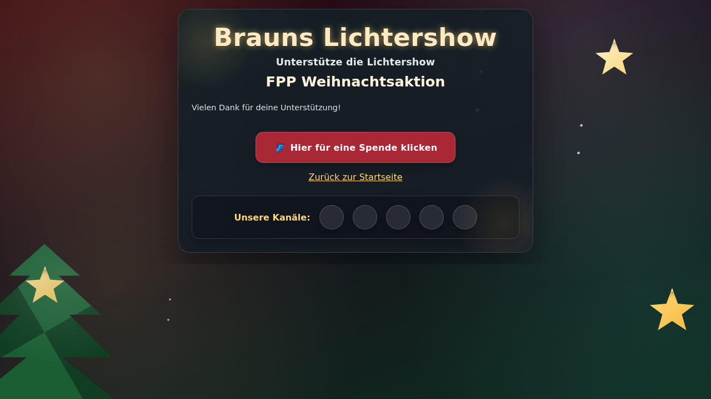

# 🎄 FPP Web Control

**Moderne Web-Steuerung für den Falcon Player (FPP) - Perfekt für interaktive Weihnachts- und Lichter-Shows**

Eine vollständig serverseitig verwaltete Web-Applikation, die Besuchern eine intuitive Oberfläche bietet, um Lichtershows zu starten, Lieder zu wünschen und zu spenden - ohne direkten Zugriff auf den Falcon Player zu benötigen.

[](https://www.docker.com/)
[](https://www.python.org/)
[](https://flask.palletsprojects.com/)

---

## 📖 Inhaltsverzeichnis

- [Überblick](#-überblick)
- [Features](#-features)
- [Screenshots](#-screenshots)
- [Schnellstart](#-schnellstart)
- [Architektur](#-architektur)
- [Konfiguration](#-konfiguration)
- [Benachrichtigungen](#-benachrichtigungen)
- [Deployment](#-deployment)
- [API-Dokumentation](#-api-dokumentation)
- [Entwicklung](#-entwicklung)
- [FAQ](#-faq)
- [Lizenz](#-lizenz)

---

## 🎯 Überblick

**FPP Web Control** ist eine benutzerfreundliche Web-Applikation zur Steuerung des Falcon Players (FPP). Sie wurde speziell für Weihnachts- und Lichtershows entwickelt, bei denen Besucher über das Internet Shows starten und Lieder wünschen können sollen.

### Warum FPP Web Control?

- **🔒 Sicherheit**: Besucher kommunizieren nur mit der Web-App, niemals direkt mit dem FPP
- **👥 Benutzerfreundlich**: Intuitive mobile Oberfläche mit festlichem Design
- **🎵 Song-Requests**: Verwaltete Warteschlange für Liedwünsche
- **📊 Statistiken**: Detaillierte Auswertungen über Show-Starts und Liedwünsche
- **🔔 Benachrichtigungen**: Push-Benachrichtigungen bei Besucher-Aktionen
- **⚙️ Flexibel**: Umfangreiche Konfigurationsmöglichkeiten über Umgebungsvariablen

### Anwendungsszenarien

- **Weihnachtshäuser**: Nachbarschaft kann Shows per Smartphone starten
- **Öffentliche Displays**: Interaktive Lichtershows mit Publikumsbeteiligung
- **Events**: Kontrollierte Show-Steuerung für Veranstaltungen
- **Privat**: Fernsteuerung der eigenen Lichtershow im LAN oder über Internet

---

## ✨ Features

### 🎮 Kern-Funktionen

- **Playlist-Steuerung**: Bis zu 2 konfigurierbare Playlists plus Liedwunsch-Button
- **Intelligente Queue**: Serverseitig verwaltete Warteschlange für Liedwünsche
- **Automatische Shows**: Zeitgesteuerter Start von Shows (z.B. jede volle Stunde)
- **Background-Modus**: Automatischer Start von Idle-Effekten nach Shows
- **Zugangsschutz**: Optionaler Zugangscode für die Steuerung

### 🎨 Benutzeroberfläche

- **Responsive Design**: Optimiert für Smartphones, Tablets und Desktop
- **Festliches Theme**: Weihnachtliche Optik mit Animationen
- **Echtzeit-Updates**: Live-Status und Countdown-Anzeige
- **Multi-Page**: Separate Seiten für Startsteuerung, Liedwünsche, Spenden und Statistiken

### 📅 Zeitsteuerung

- **Show-Zeitraum**: Definiere Start- und Enddatum der Show-Saison
- **Tägliche Showzeiten**: Automatische Button-Deaktivierung außerhalb der Zeiten
- **Countdown**: Anzeige bis zur nächsten geplanten Show
- **Flexible Planung**: Scheduled Shows können aktiviert/deaktiviert werden

### 🎵 Liedwunsch-System

- **Dynamische Songliste**: Automatisches Laden aus FPP-Playlist
- **Queue-Verwaltung**: Serverseitige Warteschlange mit Statusanzeige
- **Intelligente Unterbrechung**: Shows werden für Wünsche pausiert und später fortgesetzt
- **Dauer-Anzeige**: Zeigt Länge jedes Songs an

### 💰 Spenden-Integration

- **PayPal Pools**: Direkte Integration von PayPal-Spendenlinks
- **Buy Me a Coffee**: Optionaler zweiter Spendenbutton
- **Anpassbare Texte**: Individuelle Kampagnenbeschreibungen
- **Social Media**: Footer mit konfigurierbaren Social-Media-Links

### 📊 Statistiken

- **Detaillierte Auswertungen**: Alle Show-Starts und Liedwünsche werden erfasst
- **Grafische Darstellung**: Interaktive Charts mit Chart.js
- **Top-Listen**: Meistgewünschte Lieder und beliebteste Shows
- **Zeitverläufe**: Aktivität nach Stunden, Tagen und Wochen
- **Persistente Speicherung**: Daten werden in JSON-Datei gespeichert

### 🔔 Benachrichtigungen

- **MQTT**: Integration mit Home Assistant, MQTT-Brokern
- **ntfy.sh**: Einfache Push-Benachrichtigungen (empfohlen für Einsteiger)
- **Home Assistant Webhook**: Direkte Integration
- **Generische Webhooks**: Für eigene Integrationen

Siehe [NOTIFICATIONS.md](NOTIFICATIONS.md) für detaillierte Setup-Anleitungen.

### 🛡️ Sicherheit & Stabilität

- **API-Abstraktion**: Besucher haben keinen direkten FPP-Zugriff
- **Zugangscode**: Optionaler Schutz der Steuerung
- **Rate Limiting**: Serverseitige Verwaltung verhindert Missbrauch
- **Fehlerbehandlung**: Graceful Degradation bei FPP-Ausfall
- **Preview-Modus**: Funktioniert auch ohne FPP-Verbindung

---

## 📸 Screenshots

### Hauptseite mit Countdown

Die Startseite zeigt einen Countdown zur nächsten geplanten Show, den aktuellen Status und Buttons für Playlists, Liedwünsche und Spenden.


### Liedwunsch-Seite

Besucher können aus einer Liste verfügbarer Songs wählen. Jeder Song zeigt Titel und Dauer an.


### Spendenseite

Anpassbare Spendenseite mit PayPal Pool und optionalem Buy Me a Coffee Button.



### Hauptseite außerhalb der Showzeiten

Außerhalb der konfigurierten Showzeiten sind alle Buttons deaktiviert und ein Hinweis wird angezeigt.


### Statistikseite

Detaillierte Auswertungen mit interaktiven Charts über Show-Starts und Liedwünsche.


---

## 🚀 Schnellstart

### Voraussetzungen

- Docker und Docker Compose installiert
- Falcon Player (FPP) im gleichen Netzwerk erreichbar
- (Optional) FPP-Playlists bereits angelegt

### Installation in 5 Minuten

1. **Repository klonen**

   ```bash
   git clone https://github.com/TimUx/fpp-web-control.git
   cd fpp-web-control
   ```

2. **Konfiguration erstellen**

   ```bash
   cp .env.example .env
   ```

3. **Konfiguration anpassen**

   Öffne `.env` und passe mindestens diese Werte an:

   ```bash
   SITE_NAME="🎄 Meine Lichtershow 🎄"
   FPP_BASE_URL=http://fpp.local        # IP oder Hostname deines FPP
   FPP_PLAYLIST_1=meine-hauptshow       # Name deiner ersten Playlist
   FPP_SHOW_START_DATE=2024-12-01
   FPP_SHOW_END_DATE=2025-01-06
   FPP_SHOW_START_TIME=17:00
   FPP_SHOW_END_TIME=21:00
   ```

4. **Container starten**

   ```bash
   docker compose up -d
   ```

5. **Web-App öffnen**

   Öffne im Browser: `http://localhost:8080`

### Erste Schritte

- **Show testen**: Klicke auf "Show starten" - die entsprechende FPP-Playlist sollte starten
- **Liedwunsch testen**: Klicke auf "Lied wünschen" - die Songs aus der Wunsch-Playlist sollten angezeigt werden
- **Statistiken ansehen**: Öffne `http://localhost:8080/statistics.html`

### Für Produktion: Öffentlich zugänglich machen

Um die Web-App über das Internet erreichbar zu machen:

1. **Port-Weiterleitung im Router** einrichten: Externer Port (z.B. 8080) → Interner Port 8080 auf Server-IP
2. **DynDNS einrichten**: Kostenlose Anbieter wie DuckDNS, No-IP
3. **Optional: Zugangscode** in `.env` setzen: `ACCESS_CODE=dein-sicherer-code`
4. **Optional: HTTPS** mit Reverse Proxy (z.B. Nginx, Caddy) einrichten

---

## 🏗️ Architektur

### System-Übersicht

```
┌─────────────────────────────────────────────────────────┐
│                   Internet / WAN                        │
└────────────────────┬────────────────────────────────────┘
                     │
                     │ Port Forwarding
                     │ (z.B. 8080 → 8080)
                     │
           ┌─────────▼──────────┐
           │      Router        │
           │    (192.168.x.1)   │
           └─────────┬──────────┘
                     │
                     │
┌────────────────────┴────────────────────────────────────┐
│              Lokales Netzwerk (LAN)                     │
│                                                          │
│  ┌──────────────────────┐      ┌────────────────────┐  │
│  │  FPP Web Control     │      │  Falcon Player     │  │
│  │  (Docker Container)  │◄─────┤  (FPP)             │  │
│  │  Port 8080           │ API  │  192.168.x.x       │  │
│  └──────┬───────────────┘      └────────────────────┘  │
│         │                                                │
│         │ Optional:                                      │
│         ▼ Notifications                                  │
│  ┌──────────────────────┐                               │
│  │  MQTT Broker /       │                               │
│  │  ntfy.sh /           │                               │
│  │  Home Assistant      │                               │
│  └──────────────────────┘                               │
└──────────────────────────────────────────────────────────┘
```

### Komponenten

#### 1. Frontend (Client-seitig)

- **HTML/CSS/JavaScript**: Statische Seiten mit minimaler Client-Logik
- **Polling**: Client fragt serverseitig gecachten Status ab
- **Responsive Design**: Mobile-First-Ansatz

#### 2. Backend (Server-seitig)

- **Flask-App** (`app.py`): Python-Webserver mit REST-API
- **Status-Poller**: Background-Thread, der FPP-Status alle X Sekunden abfragt
- **Queue-Manager**: Serverseitige Verwaltung der Liedwunsch-Warteschlange
- **Scheduler**: Automatische Show-Starts zu konfigurierten Zeiten
- **Notification-System**: Multi-Channel-Benachrichtigungen

#### 3. Daten-Schicht

- **Statistiken**: JSON-Datei (`data/statistics.json`)
- **Config**: Umgebungsvariablen aus `.env`
- **Session-State**: In-Memory-State für Queue und Status

### Datenfluss

#### Show-Start durch Besucher

```
1. Besucher klickt "Show starten"
   │
   └─► POST /api/show {"type": "show"}
       │
       ├─► FPP API: Stop Playlist (falls läuft)
       ├─► FPP API: Start Playlist "show 1"
       ├─► Statistik: Event loggen
       ├─► Benachrichtigung: senden
       │
       └─► Response: {"status": "ok"}
```

#### Liedwunsch durch Besucher

```
1. Besucher öffnet Liedwunsch-Seite
   │
   └─► GET /api/requests/songs
       │
       └─► FPP API: GET /api/playlist/:PlaylistName
           │
           └─► Response: [{"title": "...", "duration": 180, ...}]

2. Besucher wählt Lied
   │
   └─► POST /api/requests {"song": "...", "duration": 180, ...}
       │
       ├─► Queue: Song zur Warteschlange hinzufügen
       ├─► Statistik: Event loggen
       ├─► Benachrichtigung: senden
       │
       └─► Wenn Queue leer war: Sofort starten
```

### FPP-API-Kommunikation

Die App nutzt folgende FPP-Endpunkte:

| Endpunkt | Methode | Verwendung |
|----------|---------|------------|
| `/api/fppd/status` | GET | Status-Polling (Scheduler, Player) |
| `/api/playlist/:name` | GET | Playlist-Details und Songliste |
| `/api/playlist/:name/start` | GET | Playlist starten |
| `/api/playlists/stop` | GET | Laufende Playlist stoppen |
| `/api/command/StopEffects` | GET | Effekte stoppen |
| `/api/command/DisableOutputs` | GET | Ausgänge deaktivieren |

**Hinweis**: Die App ist kompatibel mit FPP 6.x und 7.x. Für ältere Versionen werden Fallback-Endpunkte verwendet.

---

## ⚙️ Konfiguration

Alle Einstellungen werden über Umgebungsvariablen in der `.env`-Datei konfiguriert.

### Übersicht aller Konfigurationsparameter

#### Site Settings

| Variable | Beschreibung | Standard | Beispiel |
|----------|-------------|----------|----------|
| `SITE_NAME` | Name der Show im Header | `"FPP Lichtershow"` | `"🎄 Brauns Lichtershow 🎄"` |
| `SITE_SUBTITLE` | Untertitel mit Show-Infos | `""` | `"⏰ Täglich 17-21 Uhr ⏰"` |
| `ACCESS_CODE` | Optionaler Zugangscode | `""` | `"1234"` |
| `PREVIEW_MODE` | Demo-Modus ohne FPP | `false` | `true` / `false` |

#### FPP Connection

| Variable | Beschreibung | Standard | Beispiel |
|----------|-------------|----------|----------|
| `FPP_BASE_URL` | Basis-URL des FPP | `"http://fpp.local"` | `"http://192.168.1.100"` |
| `FPP_POLL_INTERVAL_MS` | Server-Polling-Intervall | `15000` | `10000` |
| `CLIENT_STATUS_POLL_MS` | Client-Polling-Intervall | `10000` | `5000` |

#### Playlists

| Variable | Beschreibung | Standard | Beispiel |
|----------|-------------|----------|----------|
| `FPP_PLAYLIST_1` | Name der ersten Playlist | `"show 1"` | `"hauptshow"` |
| `FPP_PLAYLIST_2` | Name der zweiten Playlist | `"show 2"` | `"kids-show"` |
| `FPP_PLAYLIST_REQUESTS` | Playlist für Liedwünsche | `"all songs"` | `"wishlist"` |
| `FPP_PLAYLIST_IDLE` | Idle/Background-Playlist | `"background"` | `"idle-effects"` |

#### Show Period

| Variable | Beschreibung | Standard | Beispiel |
|----------|-------------|----------|----------|
| `FPP_SHOW_START_DATE` | Start-Datum (YYYY-MM-DD) | - | `"2024-12-01"` |
| `FPP_SHOW_END_DATE` | End-Datum (YYYY-MM-DD) | - | `"2025-01-06"` |
| `FPP_SHOW_START_TIME` | Tägliche Start-Zeit (HH:MM) | `"16:30"` | `"17:00"` |
| `FPP_SHOW_END_TIME` | Tägliche End-Zeit (HH:MM) | `"22:00"` | `"21:30"` |
| `SCHEDULED_SHOWS_ENABLED` | Automatische Shows | `true` | `true` / `false` |

#### Button Texts

| Variable | Beschreibung | Standard | Beispiel |
|----------|-------------|----------|----------|
| `BUTTON_PLAYLIST_1` | Text für Button 1 | `"Playlist 1 starten"` | `"Hauptshow"` |
| `BUTTON_PLAYLIST_2` | Text für Button 2 | `"Playlist 2 starten"` | `"Kindershow"` |

#### Donation Settings

| Variable | Beschreibung | Standard | Beispiel |
|----------|-------------|----------|----------|
| `DONATION_POOL_ID` | PayPal Pool-ID | `""` | `"'abc123?sr=example'"` |
| `DONATION_CAMPAIGN_NAME` | Kampagnen-Name | `""` | `"Weihnachten 2024"` |
| `DONATION_SUBTITLE` | Untertitel Spendenseite | `""` | `"Unterstütze uns!"` |
| `DONATION_TEXT` | Beschreibungstext | `""` | `"Deine Spende hilft..."` |
| `BUYMEACOFFEE_USERNAME` | Buy Me a Coffee Username | `""` | `"deinusername"` |

#### Social Media

| Variable | Beschreibung | Standard |
|----------|-------------|----------|
| `SOCIAL_FACEBOOK` | Facebook-URL | `""` |
| `SOCIAL_INSTAGRAM` | Instagram-URL | `""` |
| `SOCIAL_TIKTOK` | TikTok-URL | `""` |
| `SOCIAL_WHATSAPP` | WhatsApp-URL | `""` |
| `SOCIAL_YOUTUBE` | YouTube-URL | `""` |
| `SOCIAL_WEBSITE` | Website-URL | `""` |
| `SOCIAL_EMAIL` | E-Mail-Adresse | `""` |

### Beispiel-Konfiguration

Vollständige Beispiele findest du in [`.env.example`](.env.example).

**Minimal-Konfiguration** (nur erforderliche Felder):

```bash
SITE_NAME="Meine Lichtershow"
FPP_BASE_URL=http://192.168.1.100
FPP_PLAYLIST_1=hauptshow
FPP_SHOW_START_DATE=2024-12-01
FPP_SHOW_END_DATE=2025-01-06
```

**Vollständige Konfiguration** mit allen Features:

```bash
# Site Settings
SITE_NAME="🎄 Brauns Lichtershow 🎄"
SITE_SUBTITLE="⏰ Täglich 17-21 Uhr ⏰"
ACCESS_CODE=geheim123
PREVIEW_MODE=false

# FPP Connection
FPP_BASE_URL=http://192.168.1.100
FPP_POLL_INTERVAL_MS=15000
CLIENT_STATUS_POLL_MS=10000

# Playlists
FPP_PLAYLIST_1=hauptshow
FPP_PLAYLIST_2=kindershow
FPP_PLAYLIST_REQUESTS=alle-lieder
FPP_PLAYLIST_IDLE=hintergrund

# Show Period
FPP_SHOW_START_DATE=2024-12-01
FPP_SHOW_END_DATE=2025-01-06
FPP_SHOW_START_TIME=17:00
FPP_SHOW_END_TIME=21:00
SCHEDULED_SHOWS_ENABLED=true

# Button Texts
BUTTON_PLAYLIST_1=Hauptshow starten
BUTTON_PLAYLIST_2=Kindershow starten

# Donation Settings
DONATION_POOL_ID='abc123?sr=example'
DONATION_CAMPAIGN_NAME=Spendenaktion 2024
DONATION_SUBTITLE=Unterstütze unsere Lichtershow!
BUYMEACOFFEE_USERNAME=meinusername

# Social Media
SOCIAL_INSTAGRAM=https://instagram.com/meine-show
SOCIAL_YOUTUBE=https://youtube.com/@meineshow

# Benachrichtigungen (siehe NOTIFICATIONS.md)
NOTIFY_ENABLED=true
NOTIFY_NTFY_ENABLED=true
NOTIFY_NTFY_TOPIC=meine-show-2024
```

---

## 🔔 Benachrichtigungen

FPP Web Control kann Push-Benachrichtigungen senden, wenn Besucher Shows starten oder Lieder wünschen.

### Unterstützte Methoden

- **🚀 ntfy.sh** (empfohlen für Einsteiger)
- **🏠 Home Assistant via MQTT**
- **📱 Home Assistant Webhook**
- **🔗 Generische Webhooks** (für eigene Integrationen)

### Schnellstart mit ntfy.sh (5 Minuten)

1. **ntfy.sh App installieren** ([Android](https://play.google.com/store/apps/details?id=io.heckel.ntfy) / [iOS](https://apps.apple.com/us/app/ntfy/id1625396347))

2. **Topic in der App abonnieren** (z.B. `meine-show-xyz123`)

3. **In `.env` konfigurieren**:
   ```bash
   NOTIFY_ENABLED=true
   NOTIFY_NTFY_ENABLED=true
   NOTIFY_NTFY_TOPIC=meine-show-xyz123
   ```

4. **Container neu starten**:
   ```bash
   docker compose restart
   ```

Fertig! Du erhältst jetzt Push-Benachrichtigungen auf dein Smartphone.

### Weitere Konfigurationen

Detaillierte Anleitungen für alle Benachrichtigungsmethoden findest du in **[NOTIFICATIONS.md](NOTIFICATIONS.md)**:

- Home Assistant mit MQTT
- Home Assistant Webhook
- Signal-Bot
- Nextcloud Talk
- WhatsApp Business API
- Generische Webhooks
- Fehlersuche und Diagnose

---

## 📦 Deployment

### Docker Compose (empfohlen)

**Vorteile**: Einfache Verwaltung, automatische Neustarts, Volume-Management

```bash
docker compose up -d
```

**Update auf neue Version**:

```bash
git pull
docker compose down
docker compose up --build -d
```

### Docker Run

Für manuelle Container-Verwaltung:

```bash
docker build -t fpp-control .
docker run -d \
  --name fpp-control \
  -p 8080:8000 \
  --env-file .env \
  --dns 8.8.8.8 \
  --dns 8.8.4.4 \
  -v $(pwd)/data:/app/data \
  --restart unless-stopped \
  fpp-control
```

**Wichtig**: DNS-Server (`--dns`) werden für externe Benachrichtigungsdienste benötigt.

### Manuelle Installation (ohne Docker)

Für Entwicklung oder spezielle Setups:

```bash
# Python 3.11+ erforderlich
python3 -m venv venv
source venv/bin/activate
pip install -r requirements.txt

# Konfiguration
cp .env.example .env
# .env anpassen

# Config.js generieren
bash docker-entrypoint.sh

# Server starten (Entwicklung)
python3 app.py

# Oder: Produktion mit Gunicorn
gunicorn -w 4 -b 0.0.0.0:8000 app:app
```

### Reverse Proxy (HTTPS)

Für produktiven Einsatz mit HTTPS empfohlen.

#### Mit Nginx

```nginx
server {
    listen 443 ssl http2;
    server_name lichtershow.example.com;

    ssl_certificate /path/to/cert.pem;
    ssl_certificate_key /path/to/key.pem;

    location / {
        proxy_pass http://localhost:8080;
        proxy_http_version 1.1;
        proxy_set_header Upgrade $http_upgrade;
        proxy_set_header Connection 'upgrade';
        proxy_set_header Host $host;
        proxy_cache_bypass $http_upgrade;
        proxy_set_header X-Real-IP $remote_addr;
        proxy_set_header X-Forwarded-For $proxy_add_x_forwarded_for;
        proxy_set_header X-Forwarded-Proto $scheme;
    }
}
```

#### Mit Caddy

```caddyfile
lichtershow.example.com {
    reverse_proxy localhost:8080
}
```

Caddy managed HTTPS-Zertifikate automatisch!

### Systemd Service (ohne Docker)

Für automatischen Start beim Booten:

```ini
[Unit]
Description=FPP Web Control
After=network.target

[Service]
Type=simple
User=fppcontrol
WorkingDirectory=/opt/fpp-web-control
Environment="PATH=/opt/fpp-web-control/venv/bin"
ExecStart=/opt/fpp-web-control/venv/bin/gunicorn -w 4 -b 127.0.0.1:8000 app:app
Restart=always

[Install]
WantedBy=multi-user.target
```

```bash
sudo systemctl enable fpp-control
sudo systemctl start fpp-control
```

---

## 🔌 API-Dokumentation

Die Flask-App stellt eine REST-API für die Frontend-Kommunikation bereit.

### Endpunkte

#### `GET /api/state`

Gibt den aktuellen Zustand der App zurück.

**Response**:
```json
{
  "fpp_status": {
    "status_name": "idle",
    "current_playlist": "",
    "current_sequence": "",
    "seconds_played": 0,
    "seconds_remaining": 0
  },
  "queue": [
    {
      "song": "Jingle Bells",
      "sequenceName": "jingle-bells.fseq",
      "mediaName": "jingle-bells.mp3",
      "duration": 185
    }
  ],
  "current_request": {
    "song": "Silent Night",
    "duration": 205
  },
  "scheduled_show_active": false,
  "next_show": "2024-12-24T18:00:00",
  "note": "Nächste Show um 18:00 Uhr",
  "background_active": false,
  "buttons_locked": false,
  "show_locked": false,
  "requests_locked": false,
  "quiet_mode": false,
  "outside_window": false
}
```

#### `POST /api/show`

Startet eine Playlist.

**Request**:
```json
{
  "type": "show"  // oder "kids"
}
```

**Response**:
```json
{
  "status": "ok",
  "message": "Playlist 'show 1' wird gestartet"
}
```

#### `GET /api/requests/songs`

Gibt die Liste der verfügbaren Liedwünsche zurück.

**Response**:
```json
[
  {
    "title": "Jingle Bells",
    "sequenceName": "jingle-bells.fseq",
    "mediaName": "jingle-bells.mp3",
    "duration": 185
  },
  {
    "title": "Silent Night",
    "sequenceName": "silent-night.fseq",
    "mediaName": "silent-night.mp3",
    "duration": 205
  }
]
```

#### `POST /api/requests`

Fügt einen Liedwunsch zur Warteschlange hinzu.

**Request**:
```json
{
  "song": "Jingle Bells",
  "sequenceName": "jingle-bells.fseq",
  "mediaName": "jingle-bells.mp3",
  "duration": 185
}
```

**Response**:
```json
{
  "status": "ok",
  "message": "Dein Wunsch wurde in die Warteschlange aufgenommen",
  "position": 2
}
```

#### `GET /api/statistics`

Gibt die Statistiken zurück (für Statistics-Seite).

**Response**:
```json
{
  "show_starts": [
    {
      "timestamp": "2024-12-24T18:00:00+01:00",
      "playlist": "show 1",
      "playlist_type": "playlist1"
    }
  ],
  "song_requests": [
    {
      "timestamp": "2024-12-24T18:05:00+01:00",
      "song_title": "Jingle Bells",
      "duration": 185,
      "sequence_name": "jingle-bells.fseq"
    }
  ]
}
```

### Fehler-Codes

| Status Code | Beschreibung |
|-------------|-------------|
| 200 | Erfolg |
| 400 | Ungültige Anfrage (fehlende Parameter) |
| 403 | Aktion nicht erlaubt (z.B. außerhalb Showzeiten) |
| 500 | Serverfehler |
| 503 | FPP nicht erreichbar |

---

## 🛠️ Entwicklung

### Lokale Entwicklungsumgebung

```bash
# Repository klonen
git clone https://github.com/TimUx/fpp-web-control.git
cd fpp-web-control

# Virtual Environment erstellen
python3 -m venv venv
source venv/bin/activate  # Linux/Mac
# oder: venv\Scripts\activate  # Windows

# Dependencies installieren
pip install -r requirements.txt

# .env für Entwicklung
cp .env.example .env
# PREVIEW_MODE=true setzen für Entwicklung ohne FPP

# Server starten
python3 app.py
```

Server läuft unter `http://localhost:5000` (Flask Development Server).

### Projektstruktur

```
fpp-web-control/
├── app.py                    # Flask-Backend (REST-API, Polling, Queue)
├── index.html                # Hauptseite (Show-Steuerung)
├── requests.html             # Liedwunsch-Seite
├── donation.html             # Spendenseite
├── statistics.html           # Statistik-Seite
├── styles.css                # Komplettes Styling
├── config.template.js        # Template für Frontend-Config
├── docker-entrypoint.sh      # Startup-Script (generiert config.js)
├── Dockerfile                # Docker-Image-Definition
├── docker-compose.yml        # Docker Compose Setup
├── requirements.txt          # Python-Dependencies
├── .env.example              # Beispiel-Konfiguration
├── README.md                 # Diese Datei
└── NOTIFICATIONS.md          # Benachrichtigungs-Setup
```

### Code-Struktur

**Backend (`app.py`):**
- **Flask Routes**: REST-API-Endpunkte
- **FPP API Client**: Kommunikation mit Falcon Player
- **Queue Manager**: Verwaltung der Liedwunsch-Warteschlange
- **Status Poller**: Background-Thread für FPP-Status
- **Scheduler**: Automatische Show-Starts
- **Notification System**: Multi-Channel-Benachrichtigungen
- **Statistics**: Persistente Speicherung von Events

**Frontend:**
- **Vanilla JavaScript**: Keine Frameworks, minimale Dependencies
- **Polling**: Regelmäßige Status-Abfragen via `/api/state`
- **Responsive**: Mobile-First CSS

### Testing

**Preview-Modus** für Entwicklung ohne FPP:

```bash
# In .env:
PREVIEW_MODE=true
```

Im Preview-Modus:
- Dummy-Daten für Status und Songliste
- Simulierte API-Responses
- Benachrichtigungen werden geloggt, aber nicht versendet

**Manuelle Tests:**

```bash
# Status abfragen
curl http://localhost:8080/api/state

# Show starten
curl -X POST http://localhost:8080/api/show \
  -H "Content-Type: application/json" \
  -d '{"type":"show"}'

# Liedwünsche abrufen
curl http://localhost:8080/api/requests/songs

# Lied wünschen
curl -X POST http://localhost:8080/api/requests \
  -H "Content-Type: application/json" \
  -d '{"song":"Test Song","sequenceName":"test.fseq","duration":180}'
```

### Styling anpassen

Das komplette Design befindet sich in `styles.css`:

- **CSS-Variablen**: Farben und Größen am Anfang der Datei
- **Festive Theme**: Weihnachtliche Farben und Animationen
- **Responsive**: Breakpoints für Mobile, Tablet, Desktop
- **Accessibility**: ARIA-Labels, Kontraste, Fokus-States

**Beispiel: Farben ändern**

```css
:root {
  --primary-color: #c41e3a;      /* Rot */
  --secondary-color: #0f5132;    /* Grün */
  --bg-color: #f8f9fa;           /* Hell */
  --text-color: #212529;         /* Dunkel */
}
```

### Beitragen

Pull Requests sind willkommen! Bitte:

1. Fork das Repository
2. Erstelle einen Feature-Branch (`git checkout -b feature/AmazingFeature`)
3. Committe deine Änderungen (`git commit -m 'Add AmazingFeature'`)
4. Push zum Branch (`git push origin feature/AmazingFeature`)
5. Öffne einen Pull Request

---

## ❓ FAQ

### Allgemein

**F: Brauche ich einen Falcon Player?**  
A: Für den Produktivbetrieb ja. Für Entwicklung/Demo kannst du `PREVIEW_MODE=true` setzen.

**F: Funktioniert es mit FPP 6.x?**  
A: Ja, die App ist mit FPP 6.x und 7.x kompatibel.

**F: Kann ich mehrere FPPs gleichzeitig steuern?**  
A: Nein, aktuell ist nur ein FPP pro Instanz möglich. Du kannst aber mehrere Container laufen lassen.

### Konfiguration

**F: Wie finde ich die IP meines FPP?**  
A: Im Browser auf `http://fpp.local` gehen oder mit `ping fpp.local` die IP ermitteln.

**F: Wie heißen meine FPP-Playlists?**  
A: Im FPP-Interface unter "Content Setup" → "Playlists" findest du alle Namen.

**F: Buttons sind immer deaktiviert - warum?**  
A: Prüfe `FPP_SHOW_START_DATE`, `FPP_SHOW_END_DATE`, `FPP_SHOW_START_TIME` und `FPP_SHOW_END_TIME` in der `.env`.

**F: Liedwünsche werden nicht angezeigt - was tun?**  
A: Stelle sicher, dass `FPP_PLAYLIST_REQUESTS` auf eine existierende Playlist zeigt, die Sequences enthält.

### Docker

**F: Container startet nicht - "port already in use"**  
A: Port 8080 ist bereits belegt. Ändere in `docker-compose.yml` z.B. zu `"8081:8000"`.

**F: FPP nicht erreichbar - Netzwerkfehler**  
A: Prüfe, ob FPP und Container im gleichen Netzwerk sind. Mit `--network host` im `docker run` testen.

**F: DNS-Fehler bei ntfy.sh**  
A: Stelle sicher, dass DNS-Server konfiguriert sind (siehe `docker-compose.yml` oder `--dns` bei `docker run`).

### Benachrichtigungen

**F: ntfy.sh Benachrichtigungen kommen nicht an**  
A: 
1. Topic-Name in App und `.env` identisch?
2. Container-Logs prüfen: `docker compose logs -f`
3. DNS-Problem? Siehe [NOTIFICATIONS.md](NOTIFICATIONS.md#-wichtig-dns-auflösung-in-docker)

**F: MQTT verbindet nicht**  
A: Broker-IP, Port, Username und Passwort korrekt? Firewall-Regeln prüfen.

### Features

**F: Wie deaktiviere ich automatische Shows?**  
A: Setze `SCHEDULED_SHOWS_ENABLED=false` in der `.env`.

**F: Wie ändere ich die Polling-Intervalle?**  
A: `FPP_POLL_INTERVAL_MS` (Server → FPP) und `CLIENT_STATUS_POLL_MS` (Browser → Server) in `.env` anpassen.

**F: Wo finde ich die Statistiken?**  
A: Unter `http://deine-ip:8080/statistics.html` oder auf der Hauptseite über entsprechenden Link (falls vorhanden).

**F: Werden Statistiken persistiert?**  
A: Ja, in `data/statistics.json`. Mit Volume-Mount bleiben sie bei Container-Neustarts erhalten.

---

## 📄 Lizenz

Dieses Projekt ist unter der MIT-Lizenz lizenziert - siehe [LICENSE](LICENSE) für Details.

---

## 🙏 Danksagungen

- **Falcon Player (FPP)**: https://github.com/FalconChristmas/fpp
- **Font Awesome**: Icons (https://fontawesome.com/)
- **Chart.js**: Statistik-Charts (https://www.chartjs.org/)
- **ntfy.sh**: Push-Benachrichtigungen (https://ntfy.sh/)

---

## 📞 Support & Community

- **Issues**: [GitHub Issues](https://github.com/TimUx/fpp-web-control/issues)
- **Discussions**: [GitHub Discussions](https://github.com/TimUx/fpp-web-control/discussions)

---

**Viel Erfolg mit deiner Lichtershow! 🎄✨**
