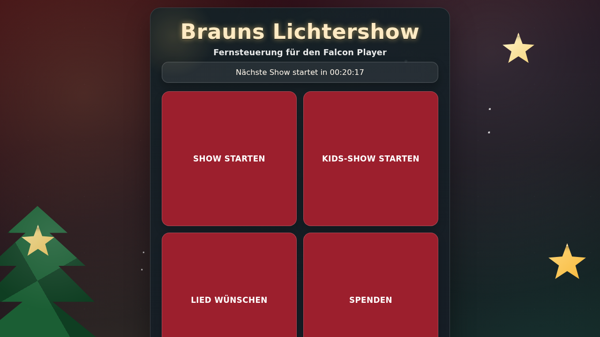
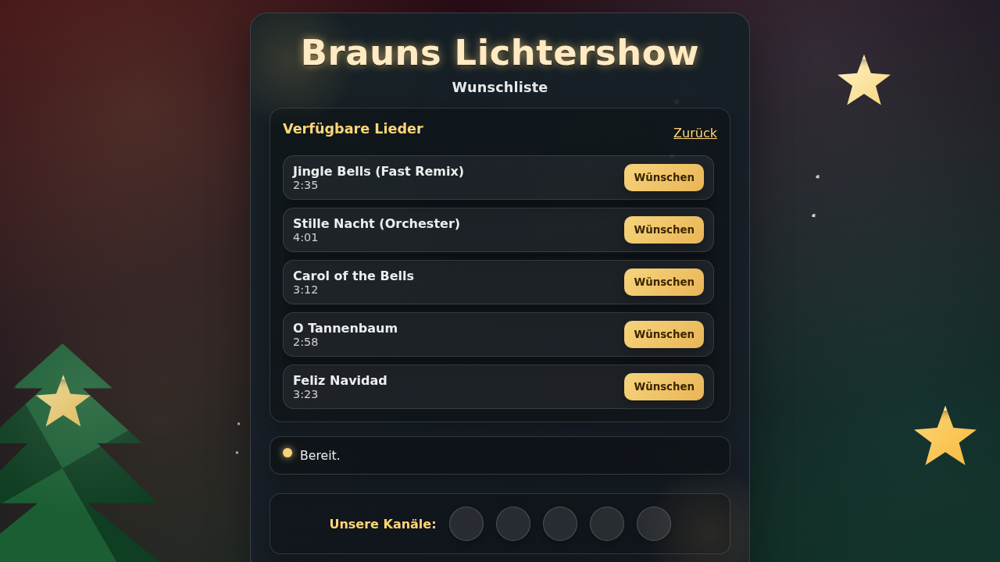
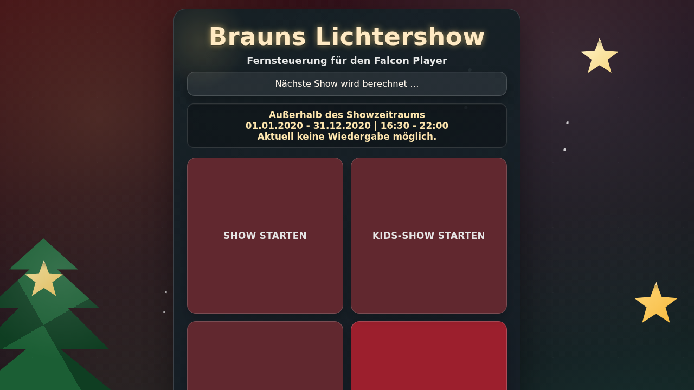

# Falcon Player Web Control

Serverseitige (Python/Flask) Steuer-Seite für den Falcon Player (FPP). Der Container kapselt alle API-Aufrufe, verwaltet Wunsch-Queue und Scheduling und liefert die festliche Mobil-Oberfläche direkt aus.

**Netzwerk-Hinweis:** Diese Web-Applikation sollte im gleichen LAN wie der Falcon Player betrieben werden. Über Port-Weiterleitungen im Router und DynDNS kann die lokal betriebene Web-Applikation für Besucher über das Internet erreichbar gemacht werden, ohne dass diese direkt mit dem Falcon Player kommunizieren müssen.

```
                                    ┌─────────────────────────────────────────────────┐
                                    │              Lokales Netzwerk (LAN)             │
                                    │                                                 │
  ┌──────────────┐                  │   ┌─────────────────┐     ┌─────────────────┐   │
  │   Besucher   │                  │   │  FPP Web        │     │  Falcon Player  │   │
  │   (Handy/    │   ──────────►    │   │  Control        │ ──► │  (FPP)          │   │
  │   Browser)   │   Internet       │   │  Container      │     │  192.168.x.x    │   │
  └──────────────┘                  │   │  :8080          │     └─────────────────┘   │
         │                          │   └─────────────────┘                           │
         │                          │            ▲                                    │
         │                          └────────────│────────────────────────────────────┘
         │                                       │
         │        ┌─────────────────┐            │
         └──────► │     Router      │ ───────────┘
    DynDNS /      │  Port-Weiter-   │   Port 8080
    öffentl. IP   │  leitung :8080  │
                  └─────────────────┘
```
**Vorteile dieser Architektur:**
- Besucher kommunizieren nur mit der Web-App, nicht direkt mit dem FPP
- Der Falcon Player bleibt im geschützten LAN
- Die Web-App übernimmt Authentifizierung und Zugangskontrolle

## Funktionen
- Zwei konfigurierbare Playlist-Buttons und ein "Lied wünschen"-Button.
- Header mit konfigurierbarem Namen (z.B. "Brauns Lichtershow").
- Serverseitig verwaltete Wunsch-Queue: Songs aus der Wunsch-Playlist werden aus dem FPP geladen, in der Web-App als Liste angezeigt (Titel + Dauer) und können einzeln angefordert werden. Vor jedem Wunsch werden Effekte gestoppt und Ausgänge deaktiviert; Wünsche laufen nacheinander.
- Warteschlange unter dem Status sichtbar: aktueller Wunsch und weitere offene Wünsche werden direkt auf der Startseite gelistet.
- Countdown zur nächsten vollen Stunde mit automatischem Start der geplanten Show. Laufende Wünsche werden dabei unterbrochen und danach fortgesetzt.
- Nach dem letzten Wunsch wird automatisch der definierte Background-Effekt (Sequence "background") wieder gestartet.
- Minimaler Client: der Browser ruft nur noch die Backend-Endpunkte auf und pollt serverseitige Statusdaten.
- Spenden-Button mit eigener Detailseite, konfigurierbarem PayPal-Pool-Link, Kampagnen-Namen und Beschreibungstext.
- Wunschseite als eigene HTML-Seite (ähnlich der Spenden-Seite) mit Songliste, Wunsch-Buttons und "Zurück"-Button zur Startseite.
- Fällt die FPP-Playlist-Anfrage aus (z.B. für Demos ohne Backend), wird automatisch eine Beispiel-Songliste angezeigt, damit eine Vorschau möglich bleibt. Im optionalen Vorschau-Modus werden alle Seiten mit Demo-Inhalten befüllt, ohne dass ein FPP erreichbar sein muss.
- Automatische Sperren: läuft ein Wunsch, sind Playlist-Buttons deaktiviert; läuft eine Standard-Show, sind alle drei Buttons bis zum Ende gesperrt. Außerhalb der konfigurierbaren Showzeiten sind alle Buttons deaktiviert.
- **🔔 Smartphone-Benachrichtigungen**: Erhalte Push-Benachrichtigungen auf dem Handy, wenn Besucher eine Show starten oder ein Lied wünschen. Unterstützt werden MQTT (für Home Assistant), ntfy.sh, Home Assistant Webhooks und generische Webhooks. Siehe [NOTIFICATIONS.md](NOTIFICATIONS.md) für Setup-Anleitungen.
- **📊 Statistikseite**: Übersicht über alle Show-Starts und Liedwünsche mit detaillierten Auswertungen. Zeigt Gesamtzahlen, Verteilung nach Playlists/Liedern, zeitliche Verläufe und Top-5-Listen. Alle Daten werden persistent gespeichert und grafisch mit interaktiven Charts dargestellt.

### Screenshots

**Hauptseite mit Countdown:**



**Wunschliste:**



**Spendenseite:**


**Hauptseite außerhalb des Showzeitraums (Buttons deaktiviert):**



**Wunschliste außerhalb des Showzeitraums:**


**Statistikseite:**


## Konfiguration per `.env`
Alle Werte werden beim Container-Start als Umgebungsvariablen gelesen. Beispiel `.env`:

```
# Site Settings
SITE_NAME=Brauns Lichtershow
SITE_SUBTITLE=Fernsteuerung für den Falcon Player
ACCESS_CODE=1234
PREVIEW_MODE=false

# FPP Connection
FPP_BASE_URL=http://fpp.local
FPP_POLL_INTERVAL_MS=15000
CLIENT_STATUS_POLL_MS=10000

# Playlists
FPP_PLAYLIST_1=show 1
FPP_PLAYLIST_2=show 2
FPP_PLAYLIST_REQUESTS=all songs
FPP_PLAYLIST_IDLE=background

# Show Period
FPP_SHOW_START_DATE=2024-12-01
FPP_SHOW_END_DATE=2025-01-06
FPP_SHOW_START_TIME=16:30
FPP_SHOW_END_TIME=22:00
SCHEDULED_SHOWS_ENABLED=true

# Button Texts
BUTTON_PLAYLIST_1=Show starten
BUTTON_PLAYLIST_2=Kids-Show starten

# Donation Settings
DONATION_POOL_ID='abc?123$=pool'
DONATION_CAMPAIGN_NAME=Winter Lights
DONATION_SUBTITLE=Unterstütze die Lichtershow
DONATION_TEXT=
BUYMEACOFFEE_USERNAME=example

# Social Media Links
SOCIAL_FACEBOOK=https://facebook.com/example
SOCIAL_INSTAGRAM=https://instagram.com/example
SOCIAL_TIKTOK=
SOCIAL_WHATSAPP=
SOCIAL_YOUTUBE=https://youtube.com/@example
SOCIAL_WEBSITE=https://example.com
SOCIAL_EMAIL=kontakt@example.com
```

Eine ausfüllbare Vorlage liegt als `.env.example` bei.

### Parameter im Überblick

#### Site Settings
- `SITE_NAME`: Text im Seitenkopf.
- `SITE_SUBTITLE`: Unterzeile unter dem Namen.
- `ACCESS_CODE`: Optionaler Zugangscode. Wenn gesetzt, zeigt die Startseite zunächst ein großes Eingabefeld; nach korrektem Code wird die Steuerung freigeschaltet.
- `PREVIEW_MODE`: `true`, um generierte Beispielinhalte anzuzeigen, falls kein FPP angebunden ist.

#### FPP Connection
- `FPP_BASE_URL`: Basis-URL des FPP (z.B. `http://fpp.local`).
- `FPP_POLL_INTERVAL_MS`: Server-seitiges Status-Abfrageintervall in Millisekunden.
- `CLIENT_STATUS_POLL_MS`: Polling-Intervall, mit dem der Browser den Server nach dem Status fragt.

#### Playlists
- `FPP_PLAYLIST_1`: Name der ersten Playlist (für Button 1).
- `FPP_PLAYLIST_2`: Name der zweiten Playlist (für Button 2).
- `FPP_PLAYLIST_REQUESTS`: Playlist mit allen verfügbaren Liedern für Wünsche.
- `FPP_PLAYLIST_IDLE`: Name der Idle-Playlist, die außerhalb von Shows/Wünschen laufen soll.

#### Show Period (Zeitraum & Showzeiten)
- `FPP_SHOW_START_DATE`, `FPP_SHOW_END_DATE`: Start-/Enddatum (`YYYY-MM-DD`) für das automatische Scheduling. Außerhalb dieses Zeitraums sind alle Buttons deaktiviert.
- `FPP_SHOW_START_TIME`, `FPP_SHOW_END_TIME`: Tägliche Showzeiten (Format: `HH:MM`). Außerhalb dieser Zeiten sind alle Buttons deaktiviert.
- `SCHEDULED_SHOWS_ENABLED`: Aktiviert (`true`, Standard) oder deaktiviert (`false`) die automatischen zeitgesteuerten Shows. Wenn auf `true` gesetzt, werden Shows zu den konfigurierten Zeiten (z.B. jede volle Stunde) automatisch gestartet. Wenn auf `false` gesetzt, findet keine automatische Wiedergabe statt – Shows können nur manuell über die Buttons gestartet werden.

#### Button Texts
- `BUTTON_PLAYLIST_1`: Beschriftung des ersten Playlist-Buttons (Standard: "Playlist 1 starten").
- `BUTTON_PLAYLIST_2`: Beschriftung des zweiten Playlist-Buttons (Standard: "Playlist 2 starten").

#### Donation Settings
- `DONATION_POOL_ID`: ID des PayPal-Pools. Pool-IDs mit Sonderzeichen in einfache Anführungszeichen setzen.
- `DONATION_CAMPAIGN_NAME`: Optionaler Name der Spendenaktion.
- `DONATION_SUBTITLE`: Unterzeile speziell für die Spendenseite.
- `DONATION_TEXT`: Freier Beschreibungstext auf der Spendenseite. Leer lassen, wenn kein Text angezeigt werden soll.
- `BUYMEACOFFEE_USERNAME`: Benutzername von buymeacoffee.com. Wenn gesetzt, erscheint ein zusätzlicher Button mit einem Hinweis, dass die Spende direkt dem Betreiber zugutekommt.

#### Social Media
- `SOCIAL_FACEBOOK`: URL zur Facebook-Seite.
- `SOCIAL_INSTAGRAM`: URL zum Instagram-Profil.
- `SOCIAL_TIKTOK`: URL zum TikTok-Profil.
- `SOCIAL_WHATSAPP`: URL/Link zu WhatsApp.
- `SOCIAL_YOUTUBE`: URL zum YouTube-Kanal.
- `SOCIAL_WEBSITE`: URL zur eigenen Website.
- `SOCIAL_EMAIL`: E-Mail-Adresse für Kontakt.

#### Benachrichtigungen
Die App kann Smartphone-Benachrichtigungen senden, wenn Besucher Aktionen ausführen (Show starten, Lied wünschen). Es werden mehrere Benachrichtigungsmethoden unterstützt, die gleichzeitig verwendet werden können:

**Allgemeine Einstellungen:**
- `NOTIFY_ENABLED`: Aktiviert Benachrichtigungen (`true`/`false`, Standard: `false`).

**MQTT-Benachrichtigungen** (für Home Assistant, MQTT-Broker):
- `NOTIFY_MQTT_ENABLED`: MQTT aktivieren (`true`/`false`).
- `NOTIFY_MQTT_BROKER`: IP/Hostname des MQTT-Brokers (z.B. `192.168.1.100` oder `homeassistant.local`).
- `NOTIFY_MQTT_PORT`: MQTT-Port (Standard: `1883`).
- `NOTIFY_MQTT_USERNAME`: MQTT-Benutzername (optional).
- `NOTIFY_MQTT_PASSWORD`: MQTT-Passwort (optional).
- `NOTIFY_MQTT_TOPIC`: MQTT-Topic für Benachrichtigungen (Standard: `fpp-control/notifications`).
- `NOTIFY_MQTT_USE_TLS`: TLS verwenden (`true`/`false`, Standard: `false`).

**ntfy.sh Push-Benachrichtigungen** (einfachste Lösung):
- `NOTIFY_NTFY_ENABLED`: ntfy.sh aktivieren (`true`/`false`).
- `NOTIFY_NTFY_URL`: ntfy.sh Server-URL (Standard: `https://ntfy.sh`, kann auch selbst gehostet werden).
- `NOTIFY_NTFY_TOPIC`: Topic-Name für Benachrichtigungen (z.B. `meine-lichtershow-2024`). In der ntfy.sh App diesen Topic abonnieren.
- `NOTIFY_NTFY_TOKEN`: Optionales Access-Token für geschützte Topics.

**Home Assistant Webhook:**
- `NOTIFY_HOMEASSISTANT_ENABLED`: Home Assistant Webhook aktivieren (`true`/`false`).
- `NOTIFY_HOMEASSISTANT_URL`: Webhook-URL (Format: `http://homeassistant.local:8123/api/webhook/WEBHOOK_ID`).
- `NOTIFY_HOMEASSISTANT_TOKEN`: Home Assistant Long-Lived Access Token.

**Generischer Webhook** (für eigene Integrationen wie Nextcloud, Signal-Bots, etc.):
- `NOTIFY_WEBHOOK_ENABLED`: Webhook aktivieren (`true`/`false`).
- `NOTIFY_WEBHOOK_URL`: Webhook-URL.
- `NOTIFY_WEBHOOK_METHOD`: HTTP-Methode (`POST` oder `GET`, Standard: `POST`).
- `NOTIFY_WEBHOOK_HEADERS`: Optionale HTTP-Headers als JSON-String (z.B. `{"Authorization": "Bearer TOKEN"}`).

**Benachrichtigungs-Payload:**
Alle Benachrichtigungen enthalten folgende Informationen:
- `title`: Kurzer Titel (z.B. "🎄 Hauptshow gestartet")
- `message`: Benachrichtigungstext
- `action_type`: Art der Aktion (`show_start`, `song_request`)
- `timestamp`: ISO-Zeitstempel
- `site_name`: Name der Show
- Zusätzliche Details je nach Aktion (Playlist-Name, Liedtitel, Warteschlangenposition, etc.)

**Setup-Beispiele:**

*ntfy.sh (am einfachsten):*
1. ntfy.sh App auf dem Smartphone installieren (Android/iOS)
2. Eigenen Topic-Namen wählen (z.B. `meine-show-xyz123`)
3. Topic in der App abonnieren
4. In `.env` setzen: `NOTIFY_ENABLED=true`, `NOTIFY_NTFY_ENABLED=true`, `NOTIFY_NTFY_TOPIC=meine-show-xyz123`

*Home Assistant über MQTT:*
1. MQTT-Broker in Home Assistant konfiguriert haben
2. In `.env` MQTT-Daten eintragen
3. In Home Assistant eine Automation erstellen, die auf `fpp-control/notifications` reagiert
4. Beispiel-Automation in Home Assistant:
```yaml
automation:
  - alias: "FPP Benachrichtigung"
    trigger:
      platform: mqtt
      topic: "fpp-control/notifications"
    action:
      service: notify.mobile_app_<dein_handy>
      data:
        title: "{{ trigger.payload_json.title }}"
        message: "{{ trigger.payload_json.message }}"
```

## Betrieb mit Docker Compose

1. `.env` wie oben erstellen.
2. Container starten:

   ```bash
   docker compose up --build
   ```

3. Seite unter `http://localhost:8080/` öffnen.

Das bereitgestellte `docker-entrypoint.sh` schreibt `config.js` mit dem Seitennamen/Poll-Intervall und startet anschließend Gunicorn mit der Flask-App.

**Hinweis:** Die `docker-compose.yml` enthält DNS-Konfiguration (Google DNS: 8.8.8.8, 8.8.4.4) für externe Benachrichtigungsdienste wie ntfy.sh.

### Alternativ: Einzel-Container

```bash
docker build -t fpp-control .
docker run --rm -p 8080:8000 --env-file .env --dns 8.8.8.8 --dns 8.8.4.4 fpp-control
```

**Wichtig:** Bei Verwendung von `docker run` müssen DNS-Server mit `--dns` angegeben werden, falls Benachrichtigungen an externe Dienste (ntfy.sh, etc.) gesendet werden sollen.

## API-Routen der Flask-App
- `GET /api/state`: Liefert aktuellen Status (FPP-Status, Queue, Countdown-Info, Hinweistext) plus UI-Sperrflags für die Buttons.
- `POST /api/show` mit Body `{ "type": "show" | "kids" }`: Startet die entsprechende Playlist und pausiert ggf. Wünsche. 
- `GET /api/requests/songs`: Liest Titel, Dauer sowie Sequence-/Media-Namen aus der Wunsch-Playlist (`FPP_PLAYLIST_REQUESTS`).
- `POST /api/requests` mit Body `{ "song": "Titel", "sequenceName": "file.fseq", "mediaName": "song.mp3", "duration": 180 }`: Fügt einen Wunsch hinzu; wenn frei, startet er sofort.

## Genutzte FPP-API-Endpunkte (laut FPP-Doku)
- `GET /api/fppd/status`: Status-Abfrage für Player/Scheduler. 
- `GET /api/playlist/:PlaylistName`: Playlist-Inhalt (Songliste für Wünsche). 
- `GET /api/playlist/:PlaylistName/start`: Start einer Playlist (Show, Kids-Show, Idle, Wünsche). Für Wunsch-Songs wird zur Laufzeit eine temporäre Single-Song-Playlist gebaut und danach wieder gelöscht.
- Fallback für ältere Installationen: `POST /api/command/Start Playlist/:PlaylistName` aus der Command-API. 
- `GET /api/command/StopEffects`, `GET /api/command/DisableOutputs`: Effekte stoppen bzw. Ausgänge deaktivieren vor Wunsch-Abspielung. 
- `GET /api/command/StopPlaylist`: Stoppt laufende Playlist; zusätzlich nutzt das Backend bei Bedarf `GET /api/playlists/stop` aus der Playlist-API.

## Styling anpassen
Die komplette Optik liegt in `styles.css`. Änderungen werden direkt als statische Datei ausgeliefert.
